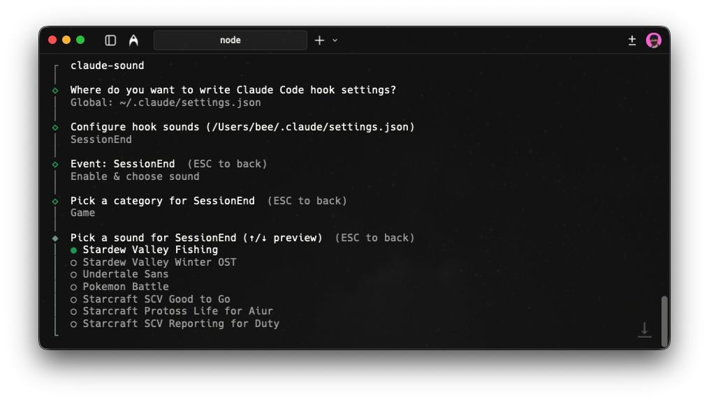

# claude-sound

macOS-only CLI that configures **Claude Code Hooks** to play **bundled sounds** using `afplay`.



- Setup UI: `npx claude-sound@latest`
- Hook runner: `npx --yes claude-sound@latest play --event <Event> --sound <SoundId> --managed-by claude-sound`

## Install / run

```bash
npx claude-sound@latest
```

You’ll be prompted to choose where to write settings:

- Project (shared): `.claude/settings.json`
- Project (local): `.claude/settings.local.json`
- Global: `~/.claude/settings.json`

Then you can enable/disable events and choose a sound per event. Selecting a sound plays a quick preview.

## Commands

```bash
claude-sound list-events
claude-sound list-sounds
claude-sound play --sound ring1
```

## What gets written

For each configured event, `claude-sound` writes a Claude hook handler like:

```json
{
  "hooks": {
    "SessionStart": [
      {
        "matcher": "*",
        "hooks": [
          {
            "type": "command",
            "command": "npx --yes claude-sound@latest play --event SessionStart --sound ring1 --managed-by claude-sound",
            "async": true,
            "timeout": 5
          }
        ]
      }
    ]
  }
}
```

`claude-sound` only manages hook handlers whose `command` contains `--managed-by claude-sound`.

## Uninstall / remove hooks

Run the setup again and choose **Remove all claude-sound hooks**, then **Apply**.

Or manually delete any hook handlers whose command contains:

```
--managed-by claude-sound
```

## Custom sound order and labels

Add `assets/sounds/order.json` to control order and display names:

```json
{
  "common": [
    { "id": "common/baemin", "label": "Baemin Delivery" },
    "common/pop",
    "common/kakaotalk"
  ],
  "game": ["game/undertale-sans", "game/pokemon-battle", ...],
  "ring": ["ring1", "ring2", "ring3", "ring4", "ring5", "ring6", "ring7", "ring8", "ring9", "ring10"]
}
```

- Use full IDs (e.g. `common/baemin`). Sounds not listed append at the end.
- Use `{ "id": "...", "label": "Display Name" }` for custom labels; otherwise the filename is shown.

## Notes

- macOS only (requires `afplay`).
- Hooks run `npx` each time the event fires. It’s simple and works everywhere, but may be slower than a local install.
